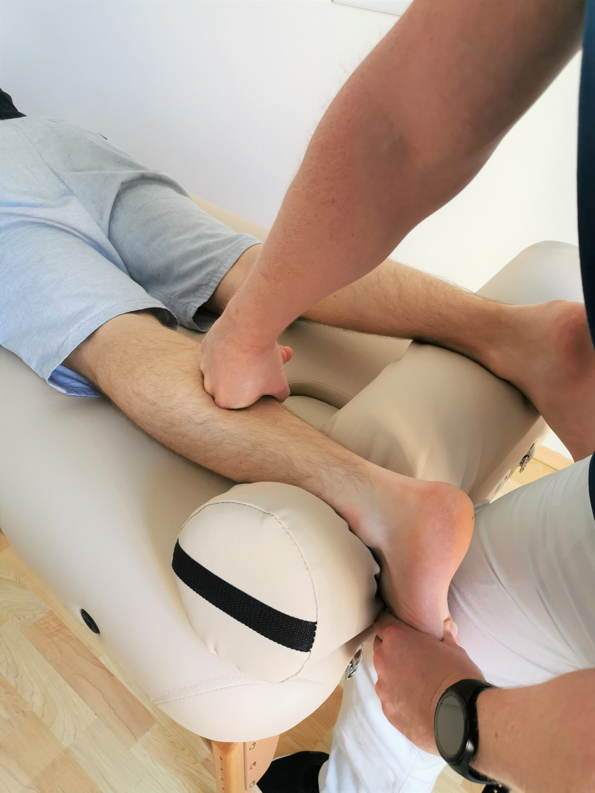

Die Faszientherapie hat in den letzten Jahren bei der Behandlung von funktionellen Bewegungseinschränkungen an Bedeutung gewonnen. Das Modell nach Typaldos bietet neue Wege in der Befundung und Behandlung von Schmerzpatienten. Patientenorientiertes Handeln und spektakuläre Ergebnisse machen dieses Konzept einzigartig.

## Vorteile des Fasziendistorsionsmodells

* schnelle effektive Behandlung von schmerzverursachenden Fasziendistorsionen (prä- und postoperativ)
* Reduktion und Beseitigung von Schmerzen am Bewegungsapparat
* bessere Kraftentwicklung durch behandelte Faszien
* mehr Gelenksstabilität durch Beeinflussung tiefer Propriozeptoren
* Sensibilisierung tauber Hautareale
* Beweglichkeitsverbesserung

## Häufig gestellte Fragen

### Sind Faszienbehandlungen schmerzhaft?

In der Therapie wird zuerst die zugrunde liegende Faszienproblematik analysiert. Abhängig davon wird die optimale Behandlungstechnik ausgewählt - dabei wird zwischen intensiven und sanften Griffen gewählt.

### Gibt es mögliche Nebenwirkungen?

Die Therapie ist ungefährlich. Wie bei vielen Therapieformen sind allerdings adäquate Reaktionen auf eine Behandlung zu erwarten. Dies hängt jedoch von sehr vielen körperbezogenen Faktoren und der gewählten Technik ab - in der Therapie werden Sie darüber gesondert aufgeklärt.
