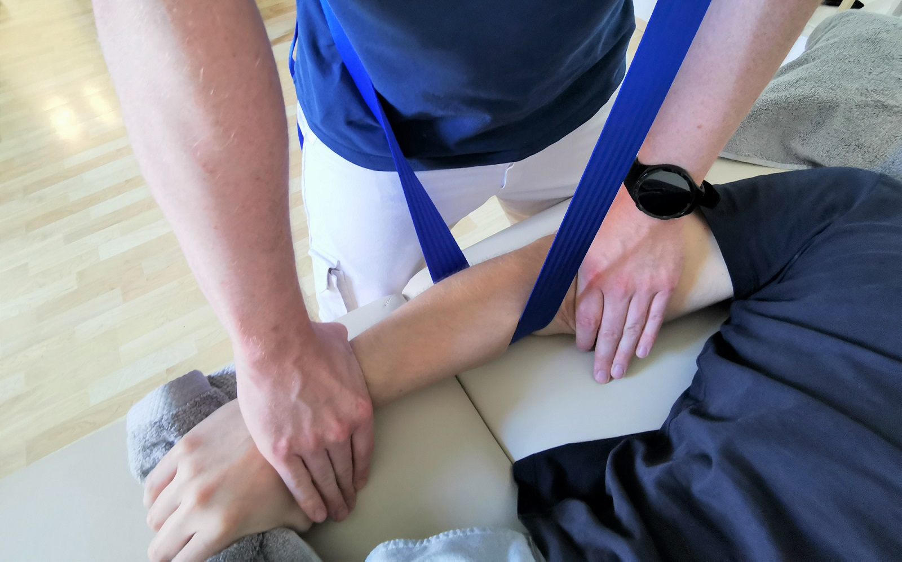
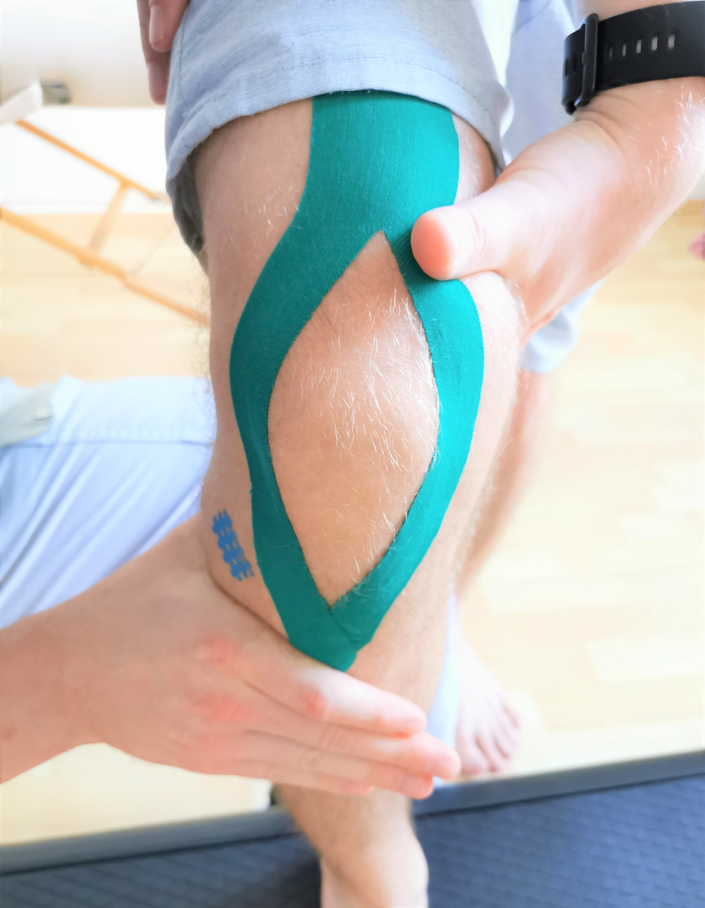

Die manuelleTherapieform nach Mulligan ist ein modernes und evidenzorientiertes Konzept bei der Behandlung von muskuloskeletalen Beschwerdebildern. Die Vereinigung passiver Mobilisation mit aktiver Patientenbewegung machen dieses Konzept so einzigartig und effektiv.

## Vorteile des Mulligan-Konzepts

* effektive Schmerzbekämpfung verursacht durch eine Gelenksfehlstellung
* komplett schmerzfreie Technik
* Verbesserung eingeschränkter Gelenksbeweglichkeit
* Spannungsreduktion strapazierter Muskeln
